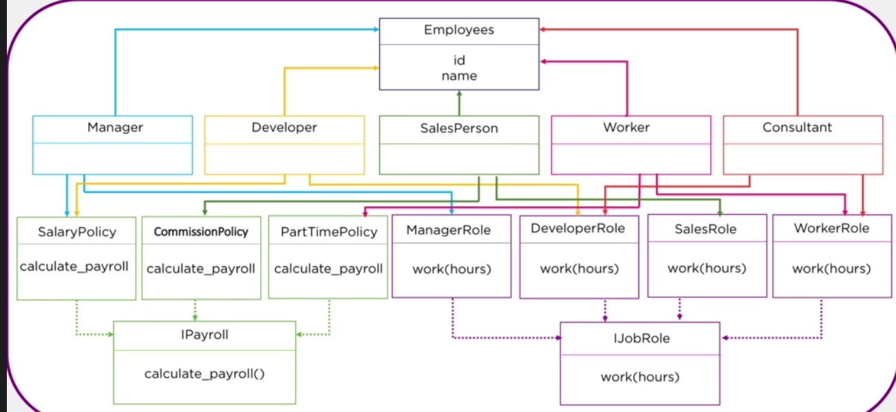

# Python Payroll Management System

Python application to calculate the payments of different employee roles. 


## Installation

1. Clone the project
2. In the terminal run
```bash
  python payrollapp.py
```

## Project Structure

### payrollapp.py
Main script file where all the required instantiations are maintained. 

### payroll.py
Where the payroll management system loops through employees and prints the final payroll sum. 

### employees.py
Where the classes of employee roles are defined along with their inheritances. 


